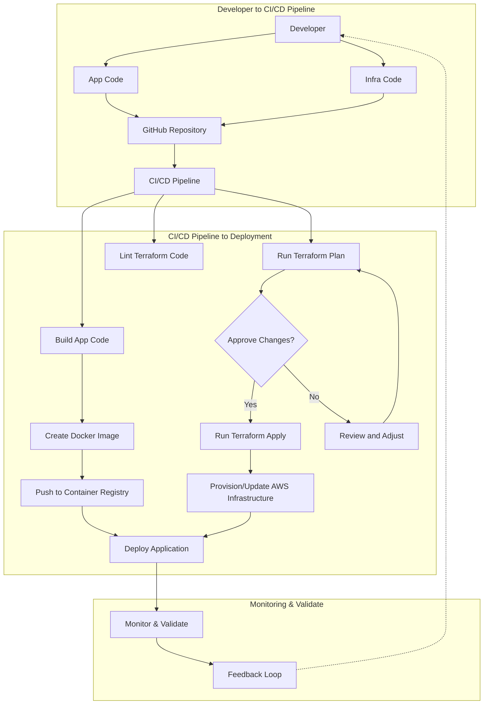

Architecture Diagram

```mermaid
graph TD
    subgraph "Developer to CI/CD Pipeline"
    A[Developer] --> B[App Code]
    A --> C[Infra Code]
    B --> D[GitHub Repository]
    C --> D
    D --> E[CI/CD Pipeline]
    end

    subgraph "CI/CD Pipeline to Deployment"
    E --> F[Build App Code]
    E --> G[Lint Terraform Code]
    E --> H[Run Terraform Plan]
    F --> I[Create Docker Image]
    I --> J[Push to Container Registry]
    H --> K{Approve Changes?}
    K -->|Yes| L[Run Terraform Apply]
    K -->|No| M[Review and Adjust]
    M --> H
    L --> N[Provision/Update AWS Infrastructure]
    N --> O[Deploy Application]
    J --> O
    end

    subgraph "Monitoring & Validate"
    O --> P[Monitor & Validate]
    P --> Q[Feedback Loop]
    Q -.-> A
    end
```
